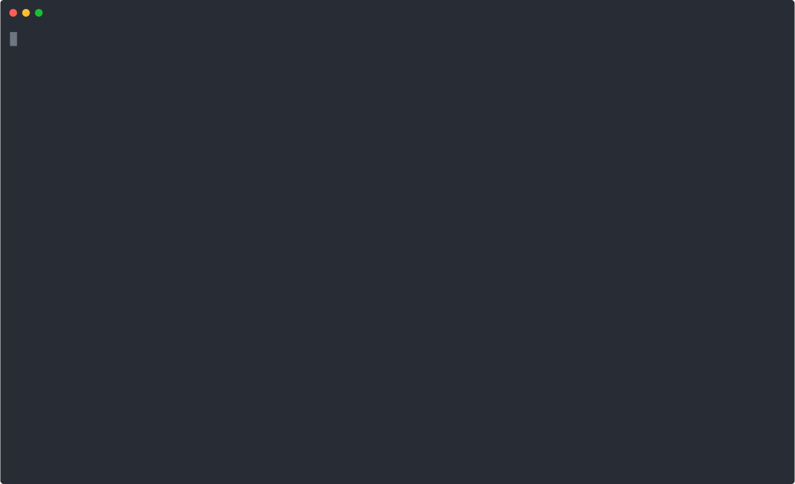

# code-indexer

Your LLM doesn't need the whole file. It needs the function.

`code-indexer` indexes TypeScript, Kotlin, Rust, and C into SQLite so you can query exactly what you need — symbol source, definition location, references — without dumping entire files into context.



---

## Why this exists

You ask an LLM to trace a bug through a TypeScript codebase. It reads `userService.ts` — thousands of tokens. Not there. Reads `authMiddleware.ts` — more tokens. Keeps going. By the time it finds the right function it's burned 20k tokens on navigation, and you're halfway through your context window before the actual work starts.

The function it needed was 30 lines long.

**Measured on [colinhacks/zod](https://github.com/colinhacks/zod) — 389 TypeScript files, 3,831 symbols, real production library:**

| Approach | Median tokens to retrieve a symbol | Recall |
|---|---|---|
| Read full file | 7,391 | 100% |
| grep ±10 lines | 188 | 100% |
| **code-indexer** | **40** | **100%** |

Same recall. 99% fewer tokens than reading the full file. 79% fewer than grep.

<details>
<summary>How were these numbers measured?</summary>

**Corpus:** [`colinhacks/zod`](https://github.com/colinhacks/zod) at commit [`c780507`](https://github.com/colinhacks/zod/commit/c7805073fef5b6b8857307c3d4b3597a70613bc2) — 389 TypeScript files, 3,831 module-level symbols.

**Sample:** All module-level symbols (classes, functions, interfaces, types, enums) indexed by `code-indexer`. No manual cherry-picking — every symbol the tool finds gets measured.

**Token counting:** `Math.ceil(characters / 4)` — a standard approximation within ~5% of cl100k_base and Claude tokenizers for source code. [Verified independently](https://platform.openai.com/tokenizer) on several zod files.

**How each approach retrieves a symbol:**

| Approach | What the LLM actually receives |
|---|---|
| Read full file | The entire `.ts` file that contains the symbol — median 7,391 tokens, max 40,082 |
| grep ±10 lines | Lines `[definition_start − 10, definition_end + 10]` — median 188 tokens |
| code-indexer | `code-indexer context <name>` — exact symbol source only — median 40 tokens, max 4,530 |

**Recall** is 100% for all three because zod uses standard TypeScript declarations — no dynamic exports or runtime symbol generation that would defeat static analysis. code-indexer uses Tree-sitter ASTs, not regex, so it correctly identifies symbol boundaries even for multi-line class bodies and complex generics.

Even at worst case (a 40,082-token file), code-indexer returns at most 4,530 tokens — a 9× saving when the file is at its largest.

**Reproduce it yourself:**

```bash
git clone https://github.com/adoroburrito/code-indexer
cd code-indexer
bun install
git clone --depth=1 https://github.com/colinhacks/zod benchmarks/zod-corpus
bun benchmarks/token-comparison.ts
```

</details>


---

## Install

```bash
curl -fsSL https://raw.githubusercontent.com/adoroburrito/code-indexer/main/install.sh | bash
```

Works on Linux (x64) and macOS (x64 + Apple Silicon). No Node.js required.

Prebuilt binaries on the [Releases page](https://github.com/adoroburrito/code-indexer/releases) if you prefer to download directly.

**Build from source** (requires [Bun](https://bun.sh)):
```bash
git clone https://github.com/adoroburrito/code-indexer
cd code-indexer
bun install
bun run build  # produces dist/code-indexer
```

---

## Quick start

```bash
# build the index (zod's 389 files index in under 2s)
code-indexer index ./my-project

# get the lay of the land
code-indexer stats

# find a symbol
code-indexer find-symbol UserService

# read just its source — not the whole file it lives in
code-indexer context UserService

# find everything that depends on it before you touch it
code-indexer find-refs UserService

# what's even in this file?
code-indexer list-symbols --file src/services/authService.ts
```

---

## Commands

| Command | What it does |
|---|---|
| `index <dir>` | Index all TS/Kotlin/Rust/C files (incremental, SHA-256 hashed) |
| `find-symbol <name>` | Find where a symbol is defined |
| `context <name>` | Extract the full source of a symbol |
| `find-refs <name>` | All references to a symbol (AST-based, not grep — no false positives from comments) |
| `list-symbols` | List indexed symbols, filter by `--file` or `--kind` |
| `list-files` | List all indexed files |
| `stats` | Index summary: file count, symbol count, db size |

Global flags: `--db <path>`, `--json` (NDJSON), `--no-refresh`, `--llm` (LLM usage guide).

Index flags: `--max-file-size <KB>` (default 512), `--max-memory <MB>` (default 2048), `--loop` (re-run until fully indexed — for very large repos).

Full reference → [wiki](../../wiki)

---

## Built for LLM agents

The tool can explain itself to an agent without any external docs:

```bash
code-indexer --llm
```

Prints a full usage guide to stdout — workflows, token cost estimates, navigation patterns. An agent that has never seen this tool can figure out exactly how to use it from that output alone.

Recommended workflow for navigating an unfamiliar codebase:

```bash
code-indexer stats                                 # is the index ready?
code-indexer list-files | grep "area/of/interest"  # where do I even start?
code-indexer list-symbols --file src/foo.ts        # what's in here?
code-indexer context SomeSymbol                    # show me the thing
code-indexer find-refs SomeSymbol                  # who's going to break if I change it?
```

---

## Unix-composable

Data to stdout, errors to stderr, tab-delimited by default, `--json` for NDJSON. Works with everything.

```bash
# how many files actually depend on this?
code-indexer find-refs UserService | cut -f1 | sort -u | wc -l

# fuzzy search (because exact-match-only is a known limitation and grep exists)
code-indexer list-symbols | grep -i "error\|handler"

# feed into jq
code-indexer list-symbols --kind interface --json | jq '.name'
```

---

## How it works

```
source files → tree-sitter AST → symbol + reference extraction → SQLite
```

- **Symbols** extracted by AST node type — no regex, no heuristics
- **References** are every identifier leaf not part of a definition; comments and strings excluded by construction
- **Incremental indexing** via SHA-256 per file — re-running skips unchanged files
- **Single SQLite file**, 4 tables, 5 indexes, WAL mode

---

## Supported languages

TypeScript (`.ts`, `.tsx`), Kotlin (`.kt`, `.kts`), Rust (`.rs`), and C (`.c`, `.h`) out of the box.

Anything else tree-sitter supports — which is [a lot](https://tree-sitter.github.io/tree-sitter/#available-parsers) — can be added by writing a small config object and plugging in the grammar. No changes to the core. [See the wiki](../../wiki/Development) if you want to add one.

---

## See also

- [Wiki](../../wiki) — full command reference, LLM integration guide, internals, known limitations
- `code-indexer --llm` — built-in LLM usage guide
- `man code-indexer` — man page, if you're into that
